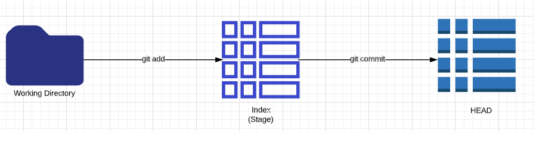
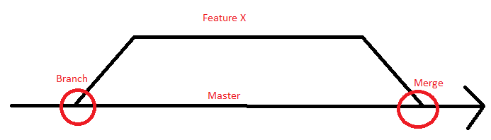
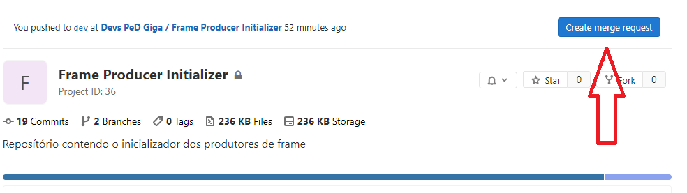
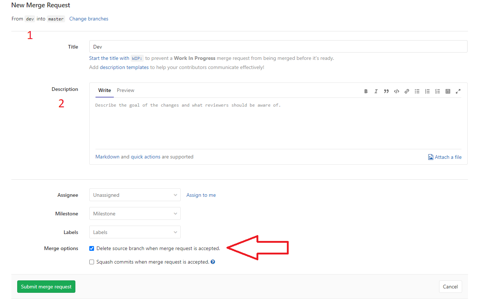
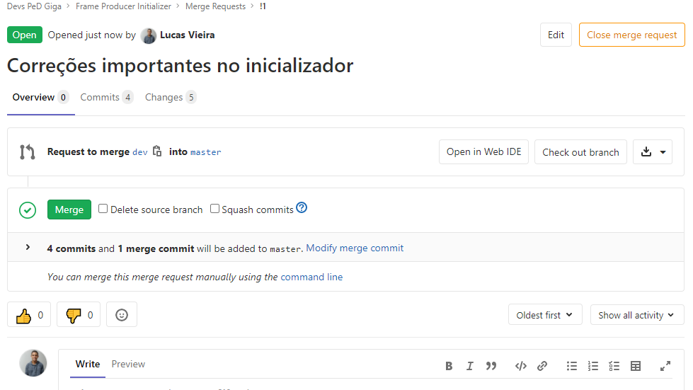

# Git - Guia Simples

## Instalação

### Windows
    http://msysgit.github.io/
### Linux
    sudo apt install git

### OSX
    http://git-scm.com/download/mac

## Criando um novo repositório
* Crie uma nova pasta, abra-a e execute o comando a seguir para criar um novo repositório
    ```
        git init
## Obtenha um repositório
* Crie uma cópia de trabalho em um repositório local executando o comando:
    ```
        git clone /caminho/para/o/repositório
* Quando usar um servidor remoto, seu comando será
    ```
        git clone usuário@servidor:/caminho/para/o/repositório

## Fluxo de trabalho
Seus repositórios locais consistem em três "árvores" mantidas pelo git. a primeira delas é sua _Working Directory_ que contém os arquivos vigentes. A segunda é a _Index_ que funciona como uma área temporária e finalmente a _HEAD_ que aponta para o último commit (confirmação) que você fez.  



## Adicionar e confirmar (add e commit)
Você pode propor mudanças (adicioná-las ao Index) usando
```
    git add <arquivo>
    git add *
```

Este é o primeiro passo no fluxo de trabalho básico do git. Para realmente confirmar estas mudanças (isto é, fazer um commit), use  

```
    git commit -m "comentários das alterações"
```

Agora o arquivo é enviado para o HEAD, mas ainda não para o repositório remoto.

## Enviando alterações
Suas alterações agora estão no _HEAD_ da sua cópia de trabalho local. Para enviar estas alterações ao seu repositório remoto, execute

```
git push origin master
```

Altere master para qualquer ramo (branch) desejado, enviando suas alterações para ele.

Se você não clonou um repositório existente e quer conectar seu repositório a um servidor remoto, você deve adicioná-lo com
```
git remote add origin <servidor>
```
Agora você é capaz de enviar suas alterações para o servidor remoto selecionado.

## Criando ramificações
_Branches_ ("ramos") são utilizados para desenvolver funcionalidades isoladas umas das outras. O _branch_ master é o _branch_ "padrão" quando você cria um repositório. Use outros _branches_ para desenvolver e mescle-os (merge) ao branch master após a conclusão.



crie um novo branch chamado **funcionalidade_x** e selecione-o usando
```
git checkout -b funcionalidade_x
```
retorne para o master usando
```
git checkout master
```
e remova o branch da seguinte forma
```
git branch -d funcionalidade_x
```
um branch não está disponível a outros a menos que você envie o branch para seu repositório remoto
```
git push origin <funcionalidade_x>
```

## Atualizar e Mesclar (pull e merge)
Para atualizar seu repositório local com a mais nova versão, execute
```
git pull
```
na sua pasta de trabalho para obter e fazer merge (mesclar) alterações remotas.
para fazer merge de um outro branch ao seu branch ativo (ex. master), use
```
git merge <branch>
```
em ambos os casos o git tenta fazer o merge das alterações automaticamente. Infelizmente, isto nem sempre é possível e resulta em conflitos. Você é responsável por fazer o merge estes conflitos manualmente editando os arquivos exibidos pelo git. Depois de alterar, você precisa marcá-los como _merged_ com
```
git add <arquivo>
```
antes de fazer o merge das alterações, você pode também pré-visualizá-as usando
```
git diff <branch origem> <branch destino>
```

## Mesclar com um repositório protegido (merge request)
<br>

Para enviar as alterações de uma branch de desenvolvimento (ex: dev) para uma branch protegida, você precisa criar um merge request. Veja a seguir:

1. Navegue até o repositório desejado e clique em **create merge request**


2. Preencha os campos corretamente e observe os detalhes do merge realizado

    - **1** contém a branch de origem e a branch de destino do merge. Neste caso, estamos fazendo merge da branch **dev** para a branch **master**.
    - **2** campo para colocar uma breve descrição sobre o merge. 
    
    - **Seta vermelha** desmarque a opção **delete source branch when merge request is accepted.** para desabilitar a deleção da branch de origem (dev, no nosso caso).

    - **Assignee**: neste campo você seleciona quem irá revisar o seu merge request (recomendo colocar pelo menos duas pessoas do time). 

    

3. Após isso, clique em **submit merge request** ao final da página e pronto! Agora é só aguardar pela revisão do merge. Veja a seguir:

    

<br>

## Sobrescrevendo alterações locais
No caso de você ter feito algo errado, é possível sobrescrever as alterações locais usando o commando
```
git checkout -- <arquivo>
```
isto substitui as alterações na sua árvore de trabalho com o conteúdo mais recente no HEAD. Alterações já adicionadas ao index, bem como novos arquivos serão mantidos.

Se ao invés disso você deseja remover todas as alterações e commits locais, recupere o histórico mais recente do servidor e aponte para seu branch master local desta forma
```
git fetch origin
git reset --hard origin/master
```
